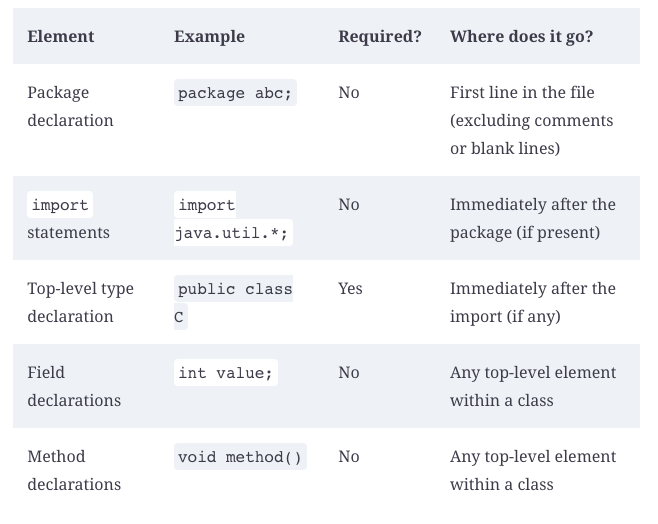
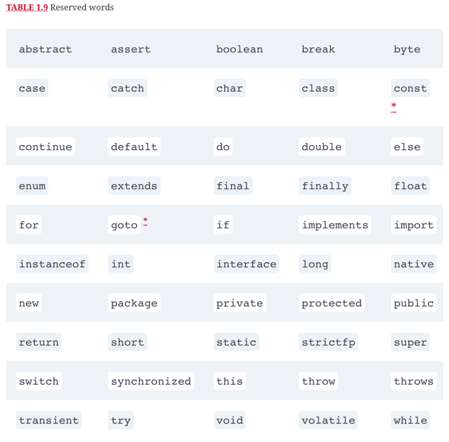

# Building blocks

## Wrong imports examples

1. 
```
import java.nio.*;            // NO GOOD - a wildcard only matches class names, not "file.Files"
```
2.
```
import java.nio.*.*;          // NO GOOD - you can only have one wildcard and it must be at the end
```

3.
```
import java.nio.file.Paths.*; // NO GOOD - you cannot import methods only class names
```

## Packages

1. Compiling together:
```
javac packagea/ClassA.java packageb/ClassB.java
```

2. Compiling together with wildcards:
```
javac packagea/*.java packageb/*.java
```

3. Compiling to other directory:
```
javac -d classes packagea/ClassA.java packageb/ClassB.java
```
4. Run program with other directory:
```
java -cp classes packageb.ClassB
java -classpath classes packageb.ClassB
java --class-path classes packageb.ClassB
```

## Create Jar files

```
jar -cvf myNewFile.jar .
jar --create --verbose --file myNewFile.jar .
jar -cvf myNewFile.jar -C dir .
```

## Ordering elements in a class



## Reserved words



## Local Variable Type Inference (var)

https://openjdk.org/projects/amber/guides/lvti-style-guide

## Scope

- Local variables: In scope from declaration to the end of the block
- Method parameters: In scope for the duration of the method
- Instance variables: In scope from declaration until the object is eligible for garbage collection
- Class variables: In scope from declaration until the program ends


## Summary

Java begins program execution with a main() method. The most common signature for this method run from the command line is public static void main(String[] args). Arguments are passed in after the class name, as in java NameOfClass firstArgument. Arguments are indexed starting with 0.

Java code is organized into folders called packages. To reference classes in other packages, you use an import statement. A wildcard ending an import statement means you want to import all classes in that package. It does not include packages that are inside that one. The package java.lang is special in that it does not need to be imported.

For some class elements, order matters within the file. The package statement comes first if present. Then come the import statements if present. Then comes the class declaration. Fields and methods are allowed to be in any order within the class.

Primitive types are the basic building blocks of Java types. They are assembled into reference types. Reference types can have methods and be assigned a null value. Numeric literals are allowed to contain underscores (_) as long as they do not start or end the literal and are not next to a decimal point (.). Wrapper classes are reference types, and there is one for each primitive. Text blocks allow creating a String on multiple lines using """.

Declaring a variable involves stating the data type and giving the variable a name. Variables that represent fields in a class are automatically initialized to their corresponding 0, null, or false values during object instantiation. Local variables must be specifically initialized before they can be used. Identifiers may contain letters, numbers, currency symbols, or _. Identifiers may not begin with numbers. Local variable declarations may use the var keyword instead of the actual type. When using var, the type is set once at compile time and does not change.

Scope refers to that portion of code where a variable can be accessed. There are three kinds of variables in Java, depending on their scope: instance variables, class variables, and local variables. Instance variables are the non-static fields of your class. Class variables are the static fields within a class. Local variables are declared within a constructor, method, or initializer block.

Constructors create Java objects. A constructor is a method matching the class name and omitting the return type. When an object is instantiated, fields and blocks of code are initialized first. Then the constructor is run. Finally, garbage collection is responsible for removing objects from memory when they can never be used again. An object becomes eligible for garbage collection when there are no more references to it or its references have all gone out of scope.