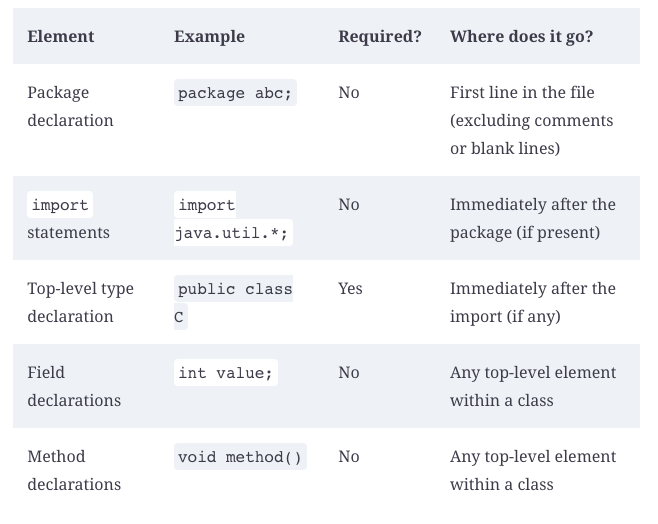

# Building blocks

## Wrong imports examples

1. 
```
import java.nio.*;            // NO GOOD - a wildcard only matches class names, not "file.Files"
```
2.
```
import java.nio.*.*;          // NO GOOD - you can only have one wildcard and it must be at the end
```

3.
```
import java.nio.file.Paths.*; // NO GOOD - you cannot import methods only class names
```

## Packages

1. Compiling together:
```
javac packagea/ClassA.java packageb/ClassB.java
```

2. Compiling together with wildcards:
```
javac packagea/*.java packageb/*.java
```

3. Compiling to other directory:
```
javac -d classes packagea/ClassA.java packageb/ClassB.java
```
4. Run program with other directory:
```
java -cp classes packageb.ClassB
java -classpath classes packageb.ClassB
java --class-path classes packageb.ClassB
```

## Create Jar files

```
jar -cvf myNewFile.jar .
jar --create --verbose --file myNewFile.jar .
jar -cvf myNewFile.jar -C dir .
```

## Ordering elements in a class

