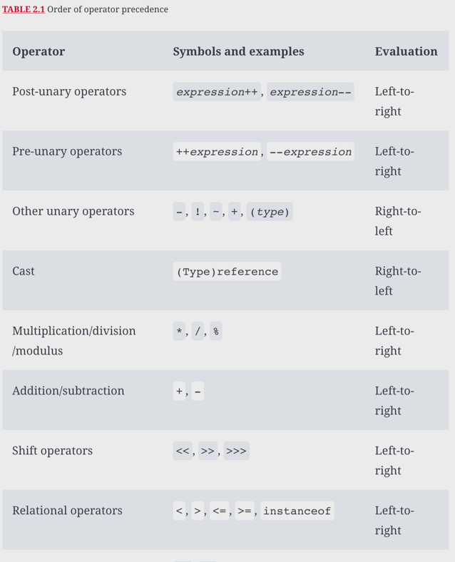
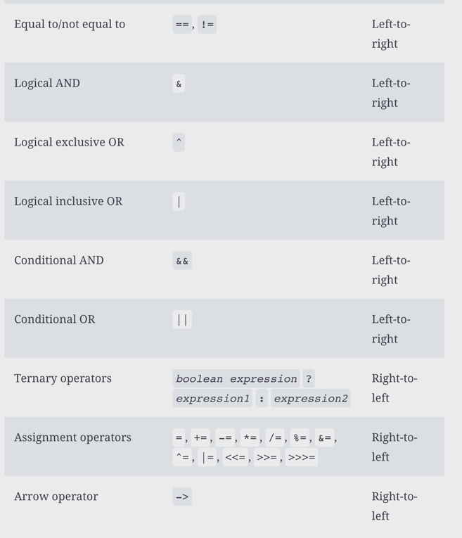
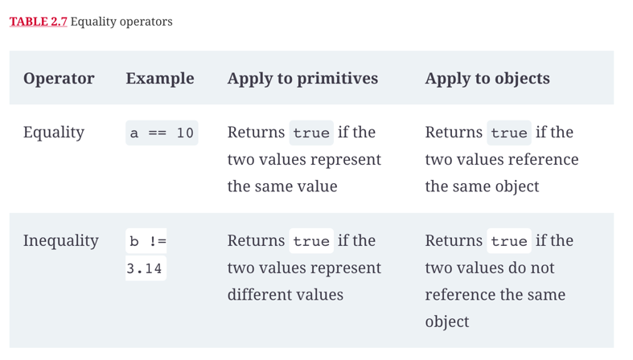
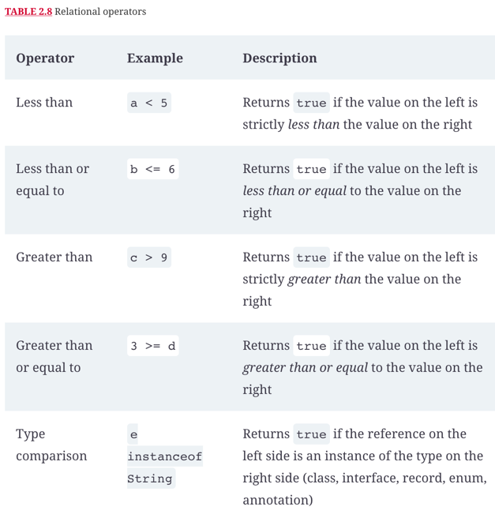
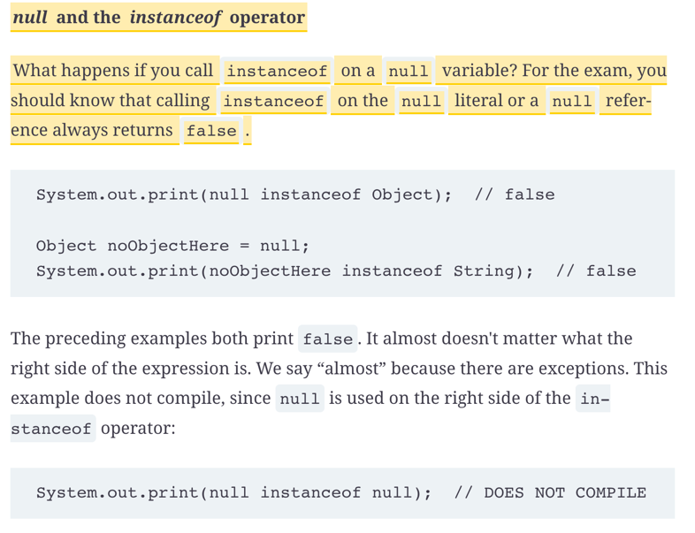
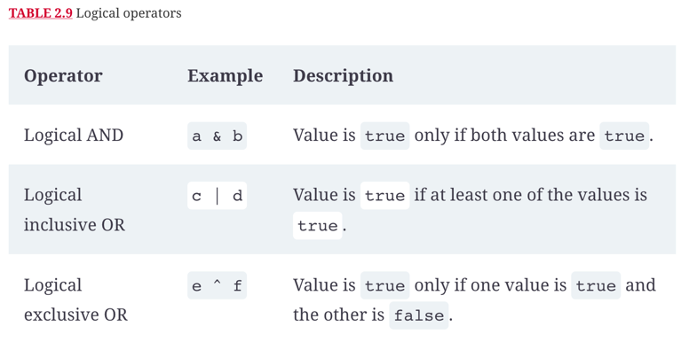
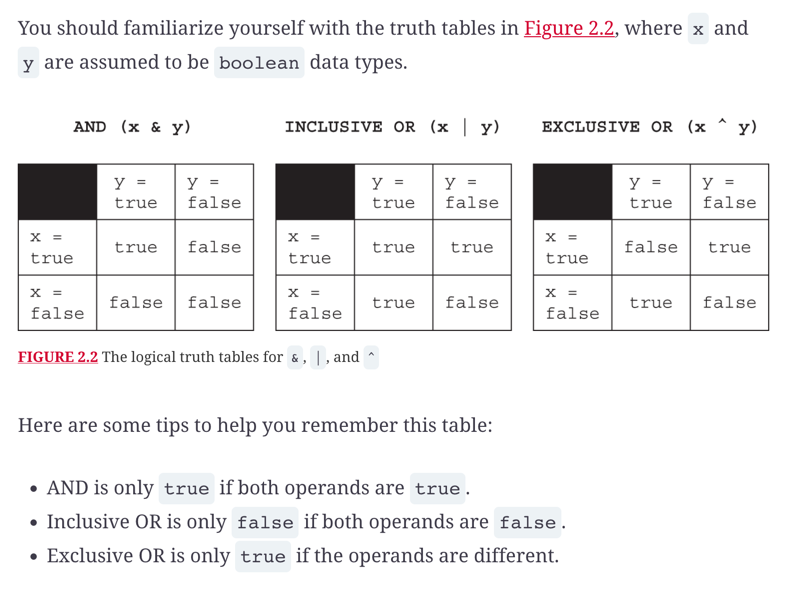
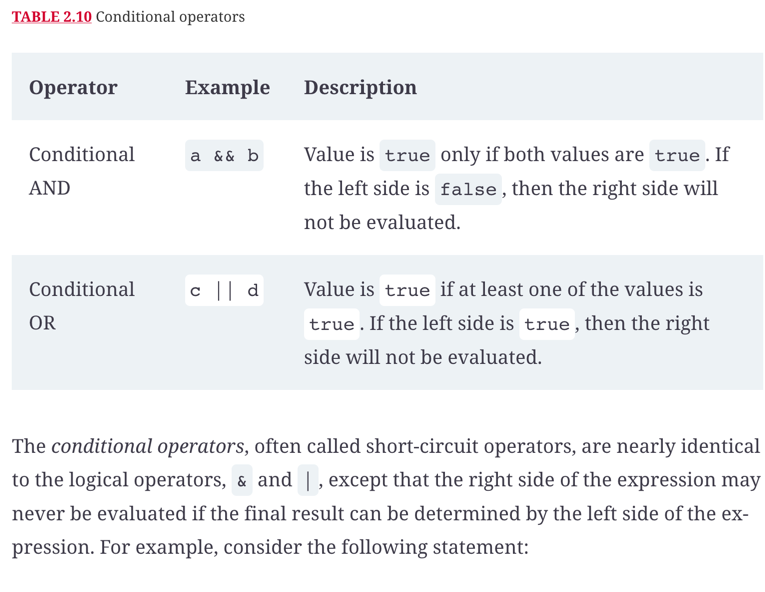

# Operators

## Operator precendence



### Bitwise of a number
- to find the bitwise complement of a number, multiply it by negative one and then subtract one.
```
System.out.println(-1*value - 1);      // -4
System.out.println(-1*complement - 1); // 3
```

### Numeric Promotion Rules

- If two values have different data types, Java will automatically promote one of the values to the larger of the two data types.
- If one of the values is integral and the other is floating-point, Java will automatically promote the integral value to the floating-point value's data type.
- Smaller data types, namely, byte, short, and char, are first promoted to int any time they're used with a Java binary arithmetic operator with a variable (as opposed to a value), even if neither of the operands is int.
- After all promotion has occurred and the operands have the same data type, the resulting value will have the same data type as its promoted operands.


### Equality operator



### Relational operators



### Instance of

- It is useful for determining whether an arbitrary object is a member of a particular class or interface at runtime.




### Logical operators





### Conditional operators



### Conditional operator ? : (known as Ternary operator)

## Review questions

Question | My Answer                                             | Correct Answer
---------|-------------------------------------------------------|---------------
1        | A, D, F, G                                            |                
2        | A, B, D                                               |                
3        | B, C, D, F                                            |                
4        | A                                                     |                
5        | A, C, D, F?, G                                        |                
6        | F                                                     |                
7        | D. true-false-false                                   |                
8        | A                                                     |                
9        | D, B                                                  |                
10       | height =1, weight=3, zebra=3, ox=6, giraffe=2-> B,C,F |                
11       | D                                                     |                
12       | D                                                     |                
13       | true - true - false - F                               |                
14       | B, E, G                                               |                
15       | D                                                     |                
16       | C                                                     |                
17       | F, C                                                  |                
18       | B                                                     |                
19       | start = -128, end = 12 -> B, F                        |                
20       | A, D                                                  |                
21       | bird = -7, plane = -8, superman=10 -> B               |                
            
