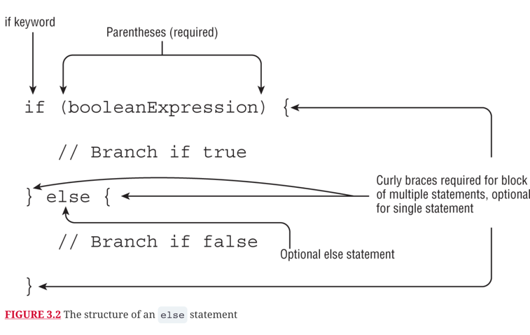
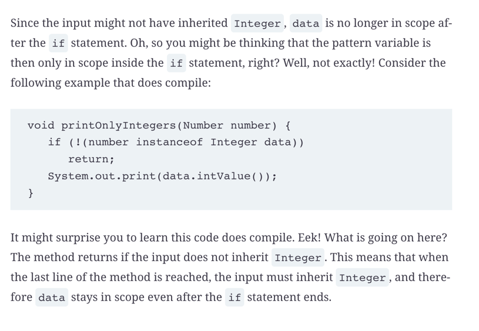
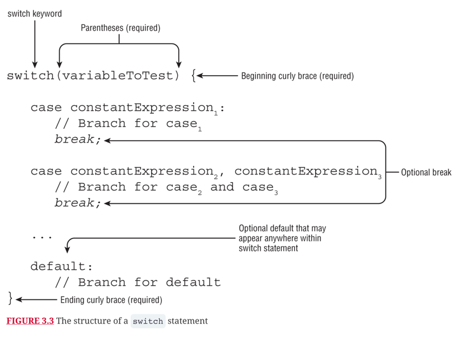
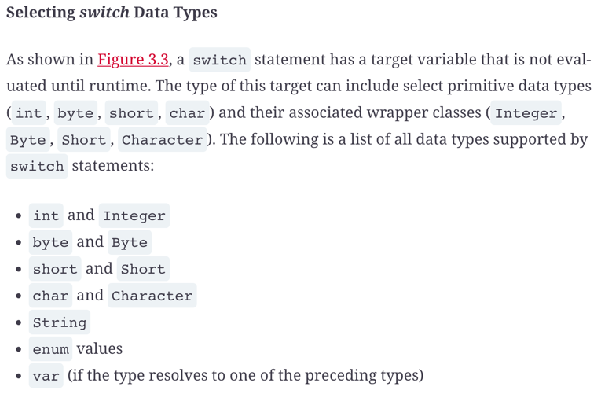
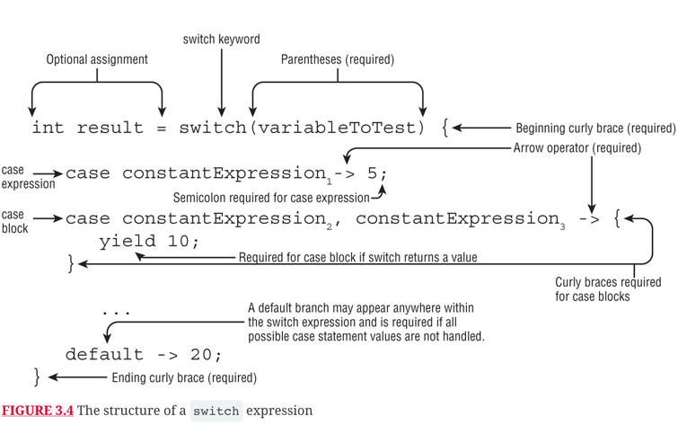
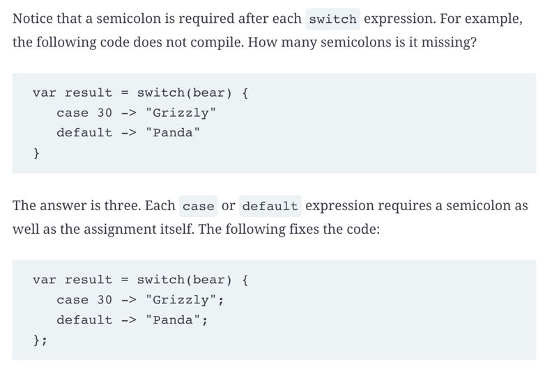
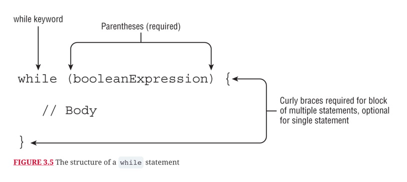
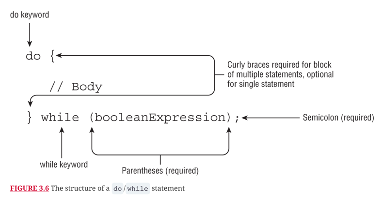
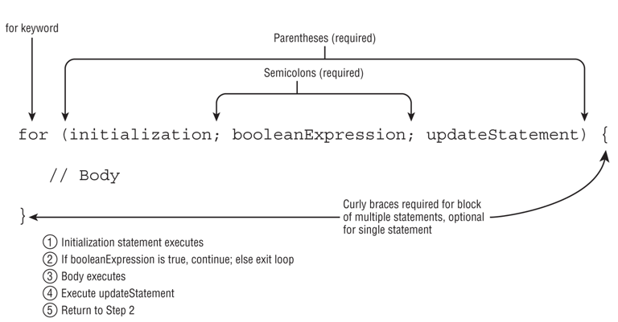

# Making decisions

## if else statement

## instanceof in if

## Switch statement

## Switch expression 

## While loops

## Do while loops

## For loop

## Review questions

Question | My Answer | Correct Answer
---------|-----------|---------------
1        |           |                
2        |           |                
3        |           |                
4        |           |                
5        |           |                
6        |           |                
7        |           |                
8        |           |                
9        |           |                
10       |           |                
11       |           |                
12       |           |                
13       |           |                
14       |           |                
15       |           |                
16       |           |                
17       |           |                
18       |           |                
19       |           |                
20       |           |                
21       |           |                
            
