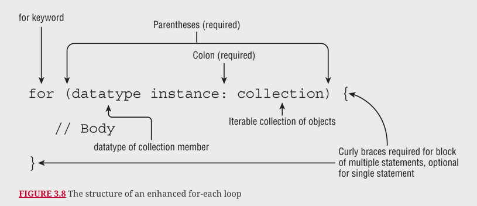
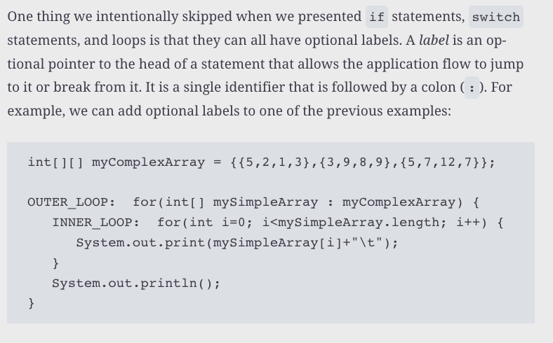
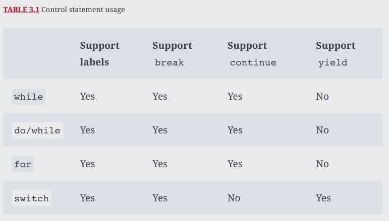

# Making decisions

## if else statement

## instanceof in if

## Switch statement

## Switch expression 

## While loops

## Do while loops

## For loop

## For each loop

## Optional labels

## Statements

### Break
### Continue
### return
### Unreachable code

### Control statement ussage

Some of the most time-consuming questions you may see on the exam could involve nested loops with lots of branching. Unless you spot an obvious compiler error, we recommend skipping these questions and coming back to them at the end. Remember, all questions on the exam are weighted evenly!

## Review questions

Question | My Answer | Correct Answer
---------|-----------|---------------
1        |           |                
2        |           |                
3        |           |                
4        |           |                
5        |           |                
6        |           |                
7        |           |                
8        |           |                
9        |           |                
10       |           |                
11       |           |                
12       |           |                
13       |           |                
14       |           |                
15       |           |                
16       |           |                
17       |           |                
18       |           |                
19       |           |                
20       |           |                
21       |           |                
            
