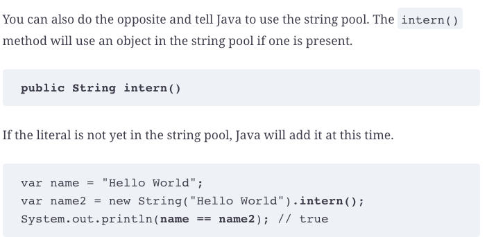
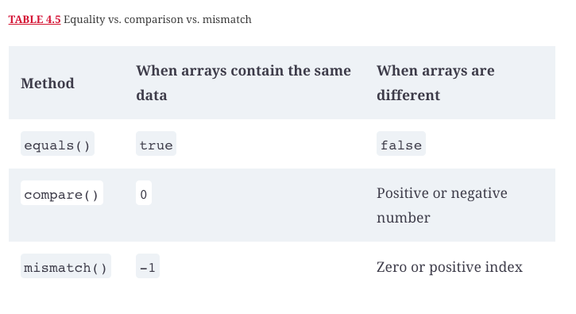

# Core APIs

## Creating and manipulating strings

String class is immutable class. This means calling a method on a String will return a different String object rather than changing the value of the reference.

#### Rules of Concatenation

1. If both operands are numeric, + means numeric addition.
2. If either operand is a String, + means concatenation.
3. The expression is evaluated left to right.

#### String methods

#### OVERRIDING TOSTRING(), EQUALS(OBJECT), AND HASHCODE()

#### indent() & stripIndent() 

#### Common formatting symbols

## Using the _StringBuilder_ Class

## Understaing equality

#### Java String Pool (JVM)

## Understaing Arrays

## Calculating with Math APIs

## Working with Dates and Times

#### Working with Durations

#### Daylight saving time

## Review questions

Question | My Answer | Correct Answer
---------|-----------|---------------
1        | a, c      | f               
2        | c, e      | c,e,f             
3        | a, c, d, f | a, c, d               
4        | a, c, d   |                
5        | b         |                 abbaccca
6        | c         |                
7        | a, d      | a, e               
8        | a, b, e, f | a, b, f                
9        | a, c, e   | a, c, f               
10       | a         |                
11       | f         |                
12       | a, d, e   |                
13       | b         |                
14       | a, f      |                
15       | c, e      |                
16       | a,b,c     |  length = 11, indent = 16, indent  = 10               
17       | a, g      |                
18       | c, e, f   |                
19       | a, b, d   |                
20       | a, d      |                
21       | a, c      |
22       | e         | a                           
