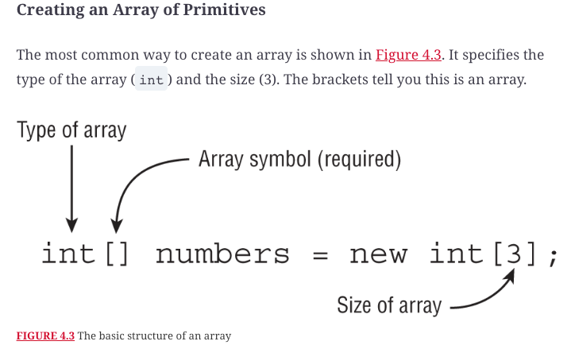

# Core APIs

## Creating and manipulating strings

String class is immutable class. This means calling a method on a String will return a different String object rather than changing the value of the reference.

#### Rules of Concatenation

1. If both operands are numeric, + means numeric addition.
2. If either operand is a String, + means concatenation.
3. The expression is evaluated left to right.

#### String methods

#### OVERRIDING TOSTRING(), EQUALS(OBJECT), AND HASHCODE()

#### indent() & stripIndent() 

#### Common formatting symbols

## Using the _StringBuilder_ Class

## Understaing equality

#### Java String Pool (JVM)

## Understaing Arrays

## Calculating with Math APIs

## Working with Dates and Times

#### Working with Durations

## Review questions

Question | My Answer | Correct Answer
---------|-----------|---------------
1        |           |                
2        |           |                
3        |           |                
4        |           |                
5        |           |                
6        |           |                
7        |           |                
8        |           |                
9        |           |                
10       |           |                
11       |           |                
12       |           |                
13       |           |                
14       |           |                
15       |           |                
16       |           |                
17       |           |                
18       |           |                
19       |           |                
20       |           |                
21       |           |                
            
