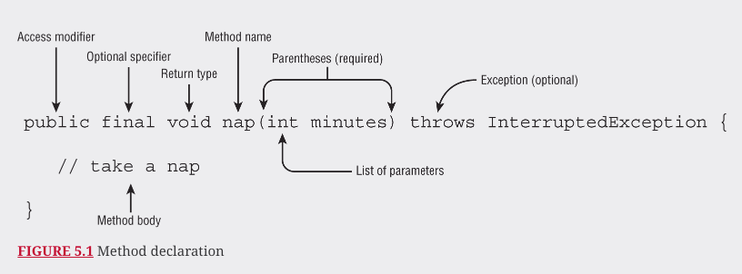
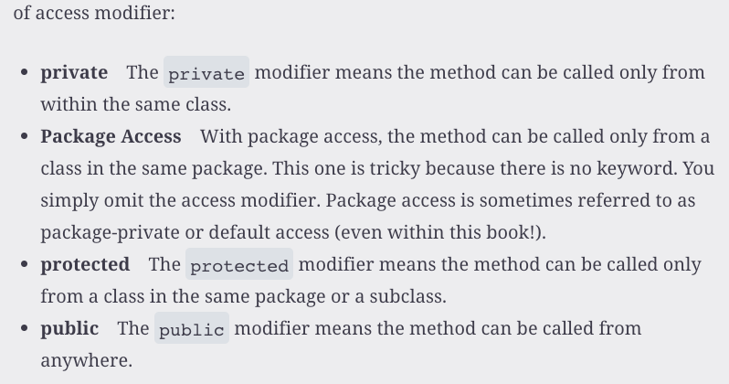
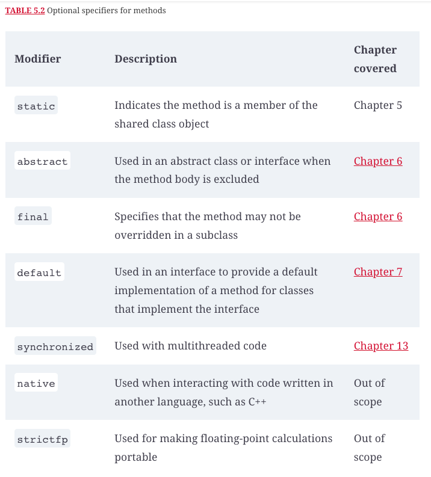
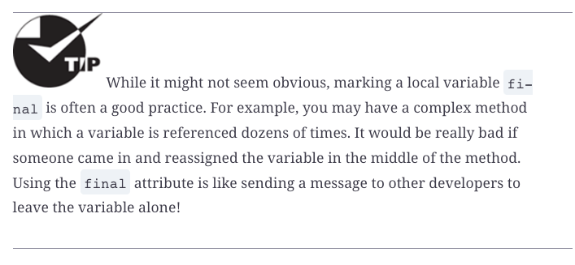
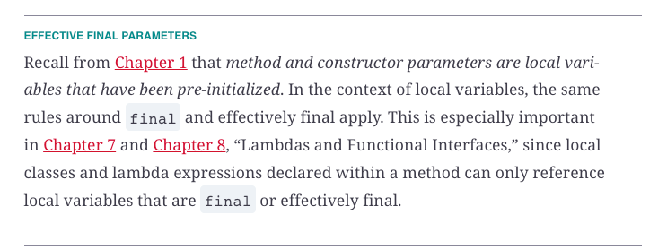
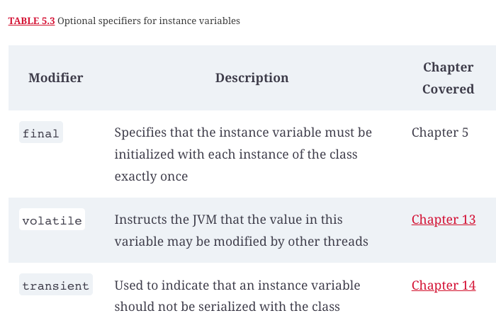
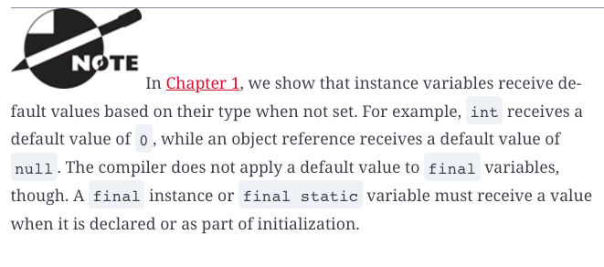
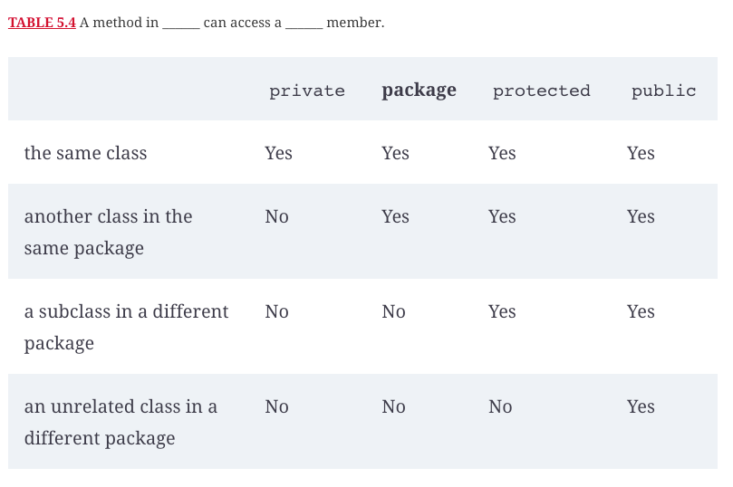
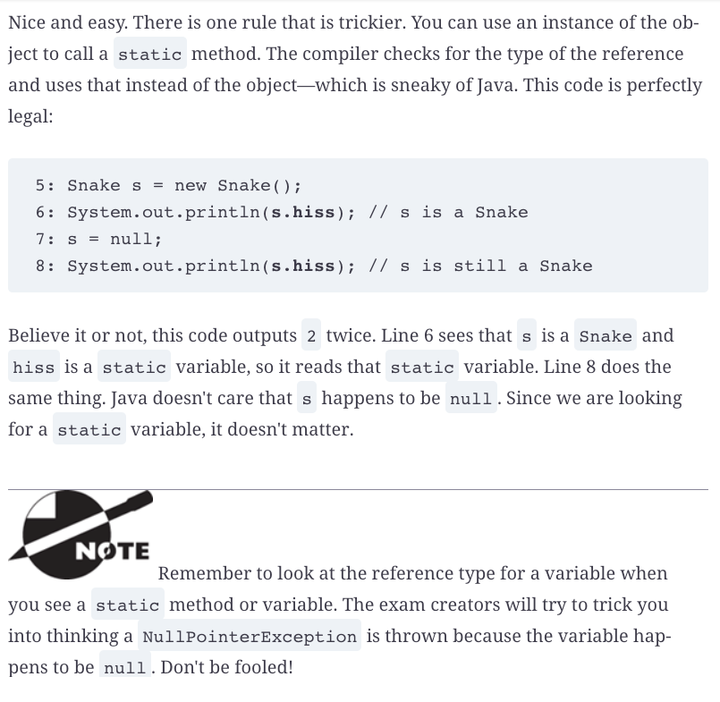

# Methods

## Designing methods

Remember, access modifiers and optional specifiers can be listed in any order, but once the return type is specified, the rest of the parts of the method are written in a specific order: name, parameter list, exception list, body.

## Declaring local and instance variables

## Working with varaargs

## Applying Access Modifiers

## Acessing static Data

## Passing data among Methods

## Overloading Methods

Question | My Answer | Correct Answer
---------|-----------|---------------
1        |           |                
2        |           |                
3        |           |                
4        |           |                
5        |           |                
6        |           |                
7        |           |                
8        |           |                
9        |           |                
10       |           |                
11       |           |                
12       |           |                
13       |           |                
14       |           |                
15       |           |                
16       |           |                
17       |           |                
18       |           |                
19       |           |                
20       |           |                
21       |           |                
            
