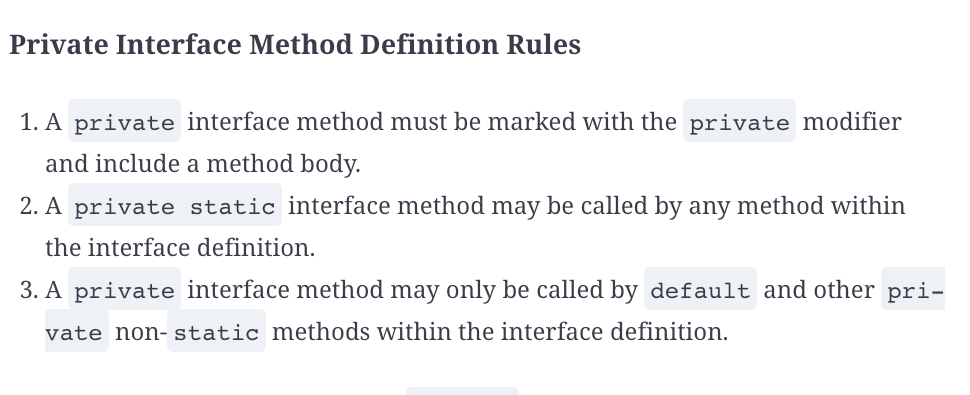

# Beyond Classes

## Implementing interfaces

An interface is an abstract data type that declares a list of abstract methods that any class implementing the interface must provide.

## Working with Enums

## Sealing Classes

## Encapsulating data with Records

## Creating nested classes

## Understanding Polymorphism

Question | My Answer | Correct Answer
---------|-----------|---------------
1        |           |                
2        |           |                
3        |           |                
4        |           |                
5        |           |                
6        |           |                
7        |           |                
8        |           |                
9        |           |                
10       |           |                
11       |           |                
12       |           |                
13       |           |                
14       |           |                
15       |           |                
16       |           |                
17       |           |                
18       |           |                
19       |           |                
20       |           |                
21       |           |                
            
